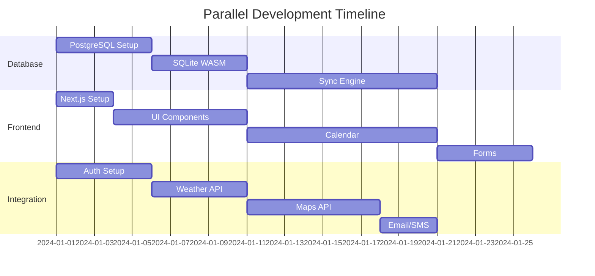

# KE Agenda V3 - Hive Implementation Plan

> **Project**: KE Agenda V3 - Local-First Scheduling Platform
> **Timeline**: 12 Weeks (3 Months)
> **Team Size**: 5-8 Developers
> **Methodology**: Parallel Development with Weekly Sync Points

---

## 🎯 Project Goals & Success Criteria

### Primary Objectives
1. **Local-First Architecture**: <200ms response for all operations
2. **72+ Hour Offline**: Full functionality without network
3. **Weather Integration**: Proactive rescheduling based on forecasts
4. **Route Optimization**: Multi-stop scheduling with <5s calculation
5. **Multi-Vertical Support**: Pet services first, then music teachers

### Success Metrics
- [ ] All local operations complete in <200ms
- [ ] App works offline for 72+ hours
- [ ] Weather alerts sent 24 hours in advance
- [ ] Route optimization saves 25% drive time
- [ ] Zero data loss during sync conflicts

---

## 👥 Team Structure & Roles

### Core Teams
```
┌─────────────────────────────────────────────────────────┐
│                    Tech Lead (1)                        │
│              Coordinates all workstreams                │
└─────────────────────────────────────────────────────────┘
                            │
        ┌───────────────────┼───────────────────┐
        ▼                   ▼                   ▼
┌──────────────┐   ┌──────────────┐   ┌──────────────┐
│  Database    │   │   Frontend   │   │  Integration │
│   Team (2)   │   │   Team (3)   │   │   Team (2)   │
├──────────────┤   ├──────────────┤   ├──────────────┤
│ • SQLite     │   │ • UI/UX      │   │ • Weather    │
│ • PostgreSQL │   │ • Calendar   │   │ • Maps       │
│ • Sync       │   │ • Forms      │   │ • Email      │
│ • Hasura     │   │ • PWA        │   │ • Auth       │
└──────────────┘   └──────────────┘   └──────────────┘
```

### Role Assignments
| Role | Count | Responsibilities | Skills Required |
|------|-------|-----------------|-----------------|
| **Tech Lead** | 1 | Architecture decisions, code reviews, blocker resolution | Full-stack, 5+ years |
| **Database Engineers** | 2 | SQLite WASM, PostgreSQL, sync engine, Hasura | SQL, TypeScript, GraphQL |
| **Frontend Engineers** | 3 | React 19, UI components, calendar, forms | React, TypeScript, CSS |
| **Integration Engineers** | 2 | External APIs, auth, background jobs | API integration, TypeScript |

---

## 📅 12-Week Sprint Plan

### Phase 1: Foundation (Weeks 1-3)
**Goal**: Core infrastructure and basic functionality

#### Week 1: Project Setup & Database Foundation
**All Teams Working in Parallel**

| Team | Tasks | Deliverables |
|------|-------|-------------|
| **Database** | • Initialize PostgreSQL schema<br>• Setup Hasura GraphQL<br>• Implement Better Auth tables<br>• Create migration system | • Working PostgreSQL database<br>• Hasura endpoint live<br>• Auth tables created |
| **Frontend** | • Next.js 15.4.5 setup<br>• Tailwind CSS config<br>• shadcn/ui components<br>• Basic routing structure | • Next.js app running<br>• Component library ready<br>• Route structure defined |
| **Integration** | • Better Auth setup<br>• Environment config<br>• Docker compose setup<br>• CI/CD pipeline | • Auth endpoints working<br>• Dev environment ready<br>• GitHub Actions configured |

#### Week 2: SQLite WASM & Local Database
**Critical Path: Database Team → Frontend Team**

| Team | Tasks | Deliverables |
|------|-------|-------------|
| **Database** | • SQLite WASM integration<br>• Kysely setup for SQLite<br>• Local schema creation<br>• Basic CRUD operations | • SQLite working in browser<br>• Kysely queries functional<br>• CRUD operations tested |
| **Frontend** | • Database provider setup<br>• TanStack Query config<br>• Basic data hooks<br>• Loading states | • Data fetching working<br>• Optimistic updates ready<br>• Error boundaries setup |
| **Integration** | • GraphQL client setup<br>• API route handlers<br>• CORS configuration<br>• Security headers | • GraphQL queries working<br>• API routes configured<br>• Security headers set |

#### Week 3: Core UI & Auth Flow
**All Teams Converge**

| Team | Tasks | Deliverables |
|------|-------|-------------|
| **Database** | • Sync queue implementation<br>• Conflict resolution<br>• Background sync worker<br>• Offline detection | • Sync engine working<br>• Queue processing<br>• Conflict handling |
| **Frontend** | • Auth UI (sign in/up)<br>• Dashboard layout<br>• Navigation menu<br>• Mobile responsive | • Auth flow complete<br>• Dashboard shell ready<br>• Mobile layout working |
| **Integration** | • JWT validation<br>• Protected routes<br>• Session management<br>• Auth middleware | • Auth fully integrated<br>• Route protection working<br>• Sessions persisted |

---

### Phase 2: Core Features (Weeks 4-6)
**Goal**: Calendar, appointments, and client management

#### Week 4: Calendar Interface
**Frontend Team Focus**

| Team | Tasks | Deliverables |
|------|-------|-------------|
| **Database** | • Appointment queries<br>• Date range filtering<br>• Recurring appointments<br>• Time zone handling | • Complex queries optimized<br>• Indexes created<br>• Performance tested |
| **Frontend** | • Calendar component<br>• Week/month views<br>• Drag-drop appointments<br>• Time slot selection | • Calendar fully functional<br>• Drag-drop working<br>• Mobile gestures supported |
| **Integration** | • Weather API setup<br>• API key management<br>• Caching strategy<br>• Rate limiting | • Tomorrow.io integrated<br>• Weather data cached<br>• Rate limits implemented |

#### Week 5: Appointment Management
**Full Stack Implementation**

| Team | Tasks | Deliverables |
|------|-------|-------------|
| **Database** | • Appointment mutations<br>• Optimistic updates<br>• Version tracking<br>• Soft deletes | • CRUD operations complete<br>• Versioning working<br>• Soft delete implemented |
| **Frontend** | • Appointment forms<br>• Client selector<br>• Service picker<br>• Duration calculator | • Forms with validation<br>• Zod schemas implemented<br>• Error handling complete |
| **Integration** | • Email notifications<br>• SMS setup (Resend)<br>• Notification queue<br>• Template system | • Email sending working<br>• SMS integration ready<br>• Templates created |

#### Week 6: Client & Pet Management
**Data Relationships**

| Team | Tasks | Deliverables |
|------|-------|-------------|
| **Database** | • Client/pet relations<br>• Search functionality<br>• Data validation<br>• Bulk operations | • Relationships working<br>• Search optimized<br>• Validation rules set |
| **Frontend** | • Client list/grid<br>• Client profiles<br>• Pet profiles<br>• Quick add flows | • Client UI complete<br>• Pet management ready<br>• Search/filter working |
| **Integration** | • Address geocoding<br>• Google Places API<br>• Location picker<br>• Map display | • Geocoding working<br>• Address autocomplete<br>• Maps integrated |

---

### Phase 3: Advanced Features (Weeks 7-9)
**Goal**: Weather, routes, and offline perfection

#### Week 7: Weather Integration
**Integration Team Focus**

| Team | Tasks | Deliverables |
|------|-------|-------------|
| **Database** | • Weather cache table<br>• Alert tracking<br>• Forecast storage<br>• Update scheduling | • Weather data cached<br>• Alerts tracked<br>• Auto-refresh working |
| **Frontend** | • Weather widgets<br>• Alert notifications<br>• Forecast display<br>• Rescheduling UI | • Weather UI complete<br>• Alerts prominent<br>• Reschedule flow ready |
| **Integration** | • Weather API polling<br>• Alert generation<br>• Push notifications<br>• Background checks | • 24hr forecasts fetched<br>• Alerts generated<br>• Notifications sent |

#### Week 8: Route Optimization
**Complex Algorithm Implementation**

| Team | Tasks | Deliverables |
|------|-------|-------------|
| **Database** | • Route cache table<br>• Distance matrix<br>• Optimization history<br>• Performance tuning | • Route data stored<br>• Matrix queries fast<br>• History tracked |
| **Frontend** | • Route map display<br>• Optimization UI<br>• Drag to reorder<br>• Time estimates | • Interactive map ready<br>• Route visualization<br>• Manual adjustments work |
| **Integration** | • Google Directions API<br>• Distance Matrix API<br>• TSP algorithm<br>• Traffic integration | • Route calculation <5s<br>• Traffic considered<br>• Optimization working |

#### Week 9: Offline Perfection
**Database Team Focus**

| Team | Tasks | Deliverables |
|------|-------|-------------|
| **Database** | • Sync refinement<br>• Conflict UI<br>• Queue management<br>• Data pruning | • 72hr offline tested<br>• Conflicts resolved<br>• Storage optimized |
| **Frontend** | • Offline indicators<br>• Sync status UI<br>• Queue display<br>• Conflict resolution | • Clear offline state<br>• Sync progress shown<br>• Conflicts manageable |
| **Integration** | • Service worker<br>• PWA manifest<br>• Cache strategies<br>• Background sync | • PWA installable<br>• Assets cached<br>• Background sync works |

---

### Phase 4: Polish & Launch (Weeks 10-12)
**Goal**: Production ready, tested, and deployed

#### Week 10: Testing & Bug Fixes
**All Teams**

| Team | Tasks | Deliverables |
|------|-------|-------------|
| **Database** | • Load testing<br>• Data migration<br>• Backup strategy<br>• Performance optimization | • Handles 1000+ users<br>• Migration scripts ready<br>• Backups automated |
| **Frontend** | • Cross-browser testing<br>• Accessibility audit<br>• Performance optimization<br>• Bug fixes | • Works on all browsers<br>• WCAG AA compliant<br>• <450KB bundle size |
| **Integration** | • API testing<br>• Rate limit testing<br>• Security audit<br>• Error tracking | • APIs resilient<br>• Rate limits enforced<br>• Security hardened |

#### Week 11: Deployment & Monitoring
**DevOps Focus**

| Team | Tasks | Deliverables |
|------|-------|-------------|
| **Database** | • Production database<br>• Hasura Cloud setup<br>• Monitoring setup<br>• Alerting config | • Production DB live<br>• Hasura configured<br>• Monitoring active |
| **Frontend** | • Vercel deployment<br>• CDN configuration<br>• Error tracking<br>• Analytics setup | • App deployed<br>• CDN configured<br>• Tracking active |
| **Integration** | • API monitoring<br>• Cost tracking<br>• Usage analytics<br>• Alert thresholds | • All APIs monitored<br>• Costs tracked<br>• Alerts configured |

#### Week 12: Launch & Documentation
**Final Push**

| Team | Tasks | Deliverables |
|------|-------|-------------|
| **All** | • User documentation<br>• API documentation<br>• Deployment guide<br>• Launch preparation | • Docs complete<br>• APIs documented<br>• Ready for users |

---

## 🔄 Parallel Workstreams

### Workstream Dependencies


### Critical Path Items
1. **SQLite WASM setup** - Blocks all local functionality
2. **Better Auth integration** - Blocks all authenticated features
3. **Sync engine** - Blocks offline functionality
4. **Calendar component** - Blocks appointment management

### Parallel Development Opportunities
Teams can work simultaneously on:
- Database schema while frontend builds UI components
- Integration APIs while database implements sync
- PWA setup while features are being built
- Testing while documentation is written

---

## 📊 Weekly Sync Structure

### Monday - Sprint Planning
```
10:00 AM - All Hands (30 min)
- Review previous week
- Blockers discussion  
- This week's goals

11:00 AM - Team Breakouts (30 min each)
- Database team sync
- Frontend team sync
- Integration team sync
```

### Wednesday - Technical Check-in
```
2:00 PM - Tech Lead Office Hours (1 hour)
- Architecture questions
- Code review requests
- Blocker resolution
```

### Friday - Demo & Retrospective
```
3:00 PM - Demo Session (1 hour)
- Each team demos progress
- Integration testing
- Feedback collection

4:00 PM - Retrospective (30 min)
- What worked
- What didn't
- Process improvements
```

---

## 🚀 Getting Started Checklist

### Week 0 - Pre-Development Setup
Each team member should:

1. **Environment Setup**
   ```bash
   # Clone repository
   git clone https://github.com/your-org/ke-agenda-v3.git
   cd ke-agenda-v3
   
   # Install dependencies
   npm install
   
   # Setup environment variables
   cp .env.example .env.local
   # Edit .env.local with your credentials
   
   # Start development
   npm run dev
   ```

2. **Tool Installation**
   - [ ] Node.js 20+
   - [ ] PostgreSQL 16+
   - [ ] Docker Desktop
   - [ ] VS Code with extensions
   - [ ] Hasura CLI

3. **Access Requirements**
   - [ ] GitHub repository access
   - [ ] Hasura Cloud account
   - [ ] Tomorrow.io API key
   - [ ] Google Maps API key
   - [ ] Resend API key

4. **Documentation Review**
   - [ ] Read tech_requirements_guide.md
   - [ ] Review database schema
   - [ ] Understand sync architecture
   - [ ] Review UI mockups

---

## 🎯 Definition of Done

### Feature Complete Checklist
- [ ] **Functionality**: Feature works as specified
- [ ] **Offline**: Works without network for 72+ hours
- [ ] **Performance**: Meets <200ms response time
- [ ] **Tests**: Unit and integration tests passing
- [ ] **Types**: Full TypeScript coverage, no `any`
- [ ] **Validation**: Zod schemas for all inputs
- [ ] **Errors**: Graceful error handling
- [ ] **Mobile**: Responsive and touch-optimized
- [ ] **Accessibility**: WCAG AA compliant
- [ ] **Documentation**: Code comments and README updated

### Code Review Checklist
- [ ] Follows tech_requirements_guide.md exactly
- [ ] Uses Better Auth (not Supabase/Clerk)
- [ ] Uses Kysely for database queries
- [ ] Implements optimistic updates
- [ ] Handles offline scenarios
- [ ] No vendor lock-in introduced
- [ ] Performance targets met
- [ ] Security best practices followed

---

## 📈 Risk Management

### High Risk Items & Mitigation

| Risk | Impact | Mitigation Strategy |
|------|--------|-------------------|
| SQLite WASM performance on iOS | High | Implement IndexedDB fallback early, test on real devices |
| Weather API costs | Medium | Implement aggressive caching, monitor usage daily |
| Google Maps quota limits | Medium | Cache route calculations, implement fallback algorithm |
| Sync conflicts | High | Simple last-write-wins strategy, clear conflict UI |
| Bundle size | Medium | Code splitting, lazy loading, monitor with every PR |

### Contingency Plans

1. **If SQLite WASM fails**: Fall back to IndexedDB with Dexie.js
2. **If Weather API too expensive**: Switch to WeatherAPI.com (backup)
3. **If Maps API quota exceeded**: Use OpenStreetMap with Leaflet
4. **If sync too complex**: Simplify to manual sync button initially
5. **If 72hr offline impossible**: Reduce to 24hr with clear messaging

---

## 🏁 Launch Criteria

### MVP Requirements (Must Have)
- [ ] User registration and authentication
- [ ] Create, edit, delete appointments
- [ ] Client and pet management
- [ ] Calendar with week/month views
- [ ] Basic weather alerts
- [ ] Simple route optimization
- [ ] 24-hour offline capability
- [ ] Mobile responsive design

### Phase 2 Features (Nice to Have)
- [ ] Recurring appointments
- [ ] Email/SMS notifications
- [ ] Photo attachments
- [ ] Revenue reporting
- [ ] Multiple business support
- [ ] White-label options

### Production Readiness
- [ ] <200ms local operation performance
- [ ] 99.5% sync success rate
- [ ] <5 second route optimization
- [ ] Zero data loss in testing
- [ ] Security audit passed
- [ ] Load testing completed (1000+ users)
- [ ] Documentation complete
- [ ] Monitoring configured

---

## 📝 Communication Channels

### Recommended Tools
- **Code**: GitHub (PRs, Issues, Discussions)
- **Chat**: Discord or Slack with channels:
  - #general - Team announcements
  - #database - Database team
  - #frontend - Frontend team  
  - #integration - Integration team
  - #blockers - Urgent issues
  - #random - Team building
- **Video**: Weekly Zoom/Meet calls
- **Docs**: GitHub Wiki or Notion
- **Project**: GitHub Projects or Linear

### Communication Guidelines
1. **Daily Updates**: Post EOD status in team channel
2. **Blockers**: Tag @tech-lead immediately
3. **Code Reviews**: Request within 24 hours
4. **Questions**: Try team channel first, then tech lead
5. **Decisions**: Document in GitHub Discussions

---

## 🎉 Success Celebration Milestones

### Week 3: First Sync Success 🎯
When the first appointment syncs between client and server

### Week 6: Calendar Complete 📅
When drag-and-drop scheduling works on mobile

### Week 9: Offline Champion 🏆
When app works offline for full 72 hours

### Week 12: Launch Day 🚀
Production deployment with first real users

---

## 📚 Resources & References

### Technical Documentation
- [Tech Requirements Guide](./tech_requirements_guide.md)
- [User Stories](./user_stories_acceptance_criteria.md)
- [Database Schema](./tech_requirements_guide.md#database-schema)

### External Documentation
- [Better Auth Docs](https://better-auth.com)
- [Kysely Docs](https://kysely.dev)
- [Hasura Docs](https://hasura.io/docs)
- [SQLite WASM](https://sqlite.org/wasm)
- [Tomorrow.io API](https://docs.tomorrow.io)
- [Google Maps Platform](https://developers.google.com/maps)

### Learning Resources
- [Local-First Software](https://www.inkandswitch.com/local-first/)
- [React 19 Features](https://react.dev/blog/2024/04/25/react-19)
- [TypeScript Handbook](https://www.typescriptlang.org/docs/)
- [PWA Best Practices](https://web.dev/progressive-web-apps/)

---

**Last Updated**: December 2024
**Project Version**: 3.0.0
**Status**: Ready for Implementation

This plan is designed for autonomous execution by distributed team members. Each workstream can progress independently while maintaining sync points for integration.